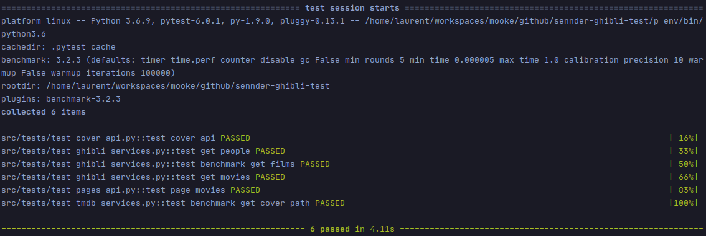
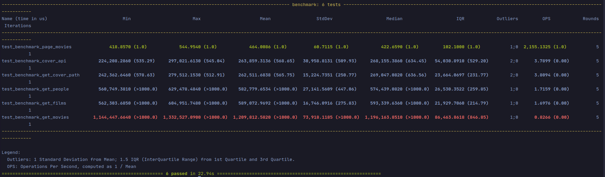

# sennder-ghibli-test
Serve a page with the movies produced by the Ghibli studio. 

## Usage 
1. Clone the repository from Github. 
```shell script
git clone git@github.com:laurentgrenier/sennder-ghibli-test.git
```
2. install the requirements
```shell script
pip install -r requirements.txt
```
3. Launch the application
```shell script
python src/app.py run 
```
4. Access the application from your favorite browser on http://localhost:8000/movies


## Test
This project is using **pytest** as the tests runner. Use the command below to execute the tests on the application. 
```shell script
pytest -v src/tests
```
> Verbose mode is prefered to follow test execution during developments.



## Benchmark
This project is using **pytest-bechmark** as the benchmark runner. Use the command below to execute the benchmarks on the application. 
```shell script
pytest -v src/benchmark
```



[TMDB](https://www.themoviedb.org/)

> Verbose mode is prefered to follow benchmark execution during developments.

## Pycharm settings 
Set the **src** directory as the root directory.

## Remarks
### Features
#### Movies page
The application display the list of the movies produced by the Ghibli Studio. For each movie, the list of characters is displayed if it's available on the Ghibli API. 

#### Caching
As required in the need expression, the API calls on the movie page are cached during 60 seconds.  

### Additional features
The application expose an API and uses it to load the movies covers and display them on the web page.
The data are loaded from the [TMDB](https://www.themoviedb.org/) API.

## For Further
Going further in development of such an application could implies the definition a docker file. \
It could event be a serverless file to deploy the application on lambda function on AWS. 
If I had a need for such an application, I'would probably choose that last solution.  

### Limitations
#### No production mode
That application is not intended to run on a production environment. In order to do that, it could be deployed on a WSGI server.

#### API keys management
The used API keys are visible in the code of the application. Usually, the key are stored in a secured way into a strongbox like Vault, a Kubernetes secret or any other secured way. \
Then, they are mounted as environment variables when running the server. 

#### No configuration
The application has no configuration file. A configuration file with configuration sections for each part of the application should be passed to the application creation at launch.    
